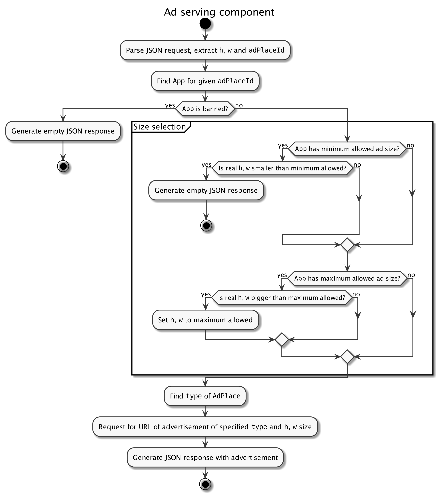

# Intro

You are given a piece of weird code. You should refactor the code
and implement a new feature.

While doing this try to imagine that:

- You have a lot of tasks in your backlog for this component, so it's not a 
"write-and-forget" task.
- This component will be soon deployed on production and may experience 
bugs and errors there. You will be responsible for identifying and fixing them.
- System administrators would like to have a leverage on the project
configuration.

## Ad serving component

The component serves advertisements to mobile clients. It receives an ad request,
selects the proper advertisement size and type and serves it to the client.
Please, have a look on the overall scheme:

There is the `Facade` which accepts JSON requests in the form of:

`{"adPlaceId":"1f855d85-6b3b-4113-af6b-c87b1b39e185","h":150,"w":150}`

where:

 - `adPlaceId` is the identifier of the ad place
 - `h`, `w` is the real size of a ad space rectangle on the mobile device screen
 where the advertisement will be displayed.

If a proper banner found, `Facade` returns JSON a response in the form of:

`{"url":"http://cdn202.example.com/img/150x150.gif","type":"animation"}`

where:

- `url` is just a URL of the advertisement
- `type` is the type of the  advertisement, so the mobile device understand
how to display it.

If no banner was found, then an empty json will be returned:

`{}`

Of course, like in a real life the description can be incomplete or not 
accurate.

# Task

## Refactor

Refactor the code as good as you would like to. You can rewrite everything, 
but keep application functionality. Don't bother about any remote
accessible interfaces, only the command line will be used to launch this 
component.

## Size selection feature

After refactoring you should add a feature to this component.

Currently `App` has only optional minimum and maximum advertisement size. 
All ad spaces with real size below minimal are discarded and all ad spaced which
bigger than maximum are narrowed down to maximum. `BannerImageService` generates
advertisements of requested width and height "on-the-fly". It turned out that 
generating of `video` advertisements is a very slow process, so for this type
of advertisements, we have decided to use the pre-generated content. Your task
is to add a feature that will take a real ad space dimensions, and select the
pre-generated video with the closest and biggest dimensions which will fit the
ad space. For the start, we decided to have four sizes of pre-generated videos 
with sizes (width x height) of:

- 320x240
- 640x480
- 1280x720
- 1440x900

Don't forget about size limitations in `App`.

As a bonus, you can implement an additional feature that will allow add, remove 
or change the sizes in runtime. As a second bonus, you can make this feature 
thread-safe.

# (Un)Limitations

You don't have any limitations, just keep application functionality.
You can:

- Add or remove any dependencies
- Extract or add any classes and methods
- Change structure of any class
- Rename or move any class fields
- Change code formatting and use any code-style you want
- Rewrite everything from the scratch
- Do whatever you want, it's your code :-)

In case you have any unclear points, please make a decision on your own and
list your assumptions with a short explanation in the cover letter. Also
mention the amount of time you spent on this task, but we expect you will
work on it at least three hours.

Please do not make public forks and pull-requests. Just sent the result in
a zip file.

Have a good time!
